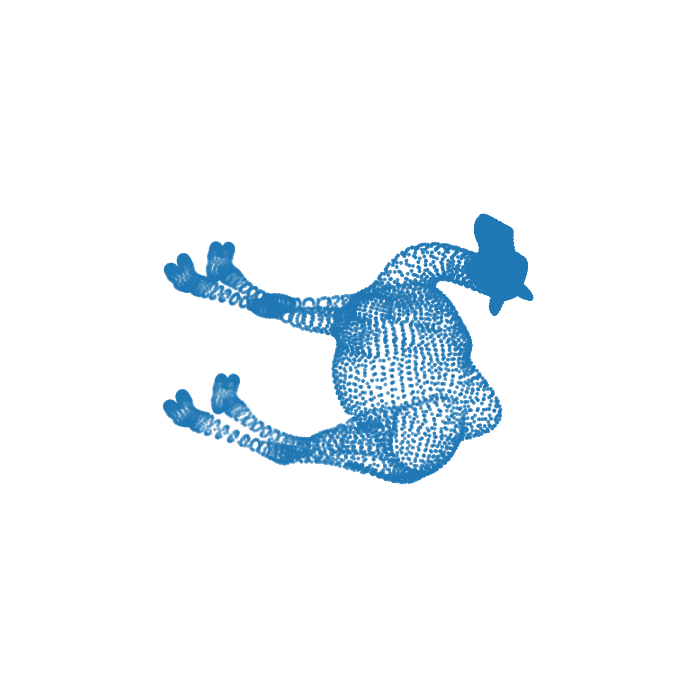
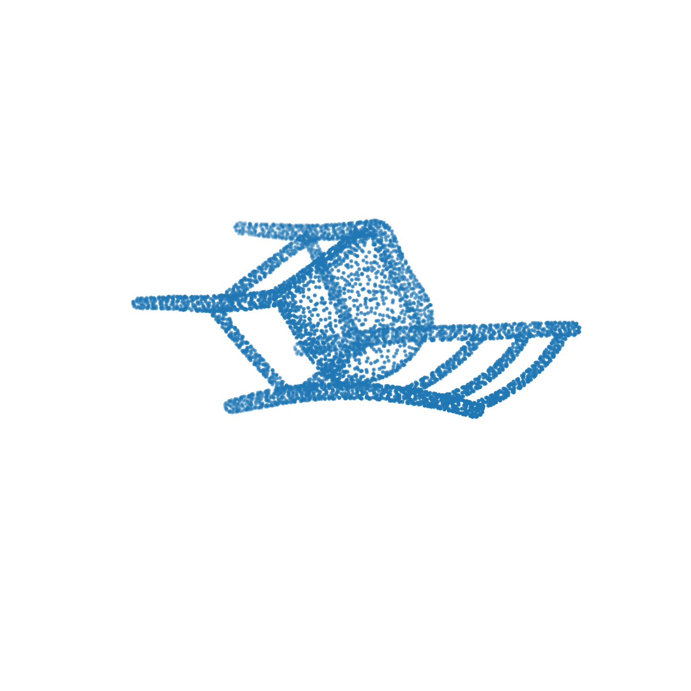
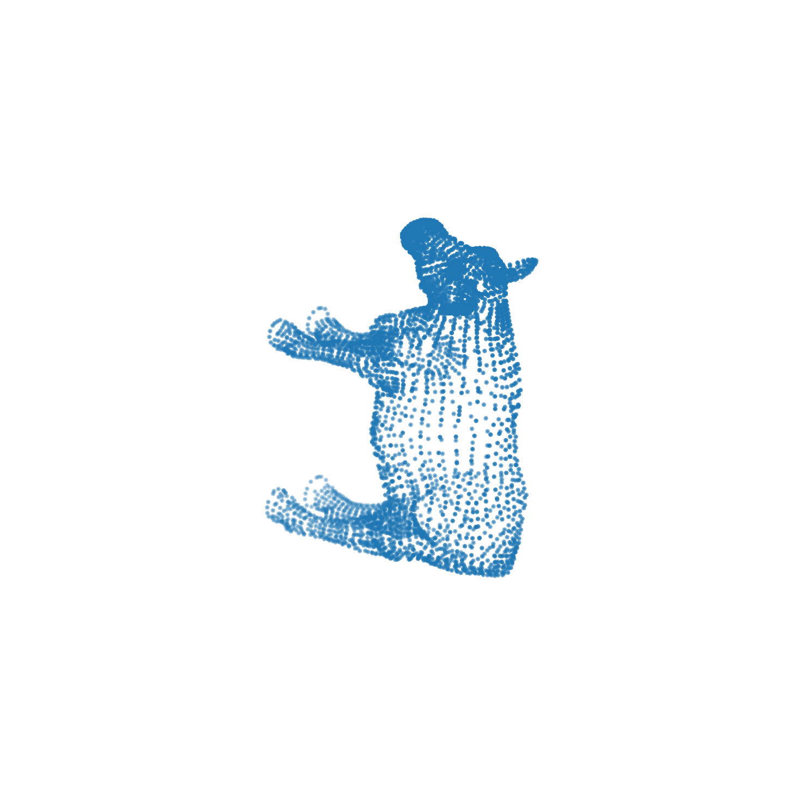

# **Re-imagining Point Cloud Diffusion in Latent Space**
### CS 299 — Semester Project | Indian Institute of Technology Gandhinagar

  

---

## **Introduction**

3D point cloud denoising is a core problem in geometric vision, arising in applications such as LiDAR sensing, depth reconstruction, and multi-view 3D capture. Real-world point clouds are often corrupted by noise that distorts both **local surface geometry** and **global object structure**, making robust denoising challenging.

Recent diffusion-based methods—most notably **P2P-Bridge (ECCV 2024)**—have demonstrated strong performance by directly operating in raw XYZ coordinate space. While effective for surface refinement, coordinate-space diffusion lacks an explicit mechanism to model higher-level geometric structure and long-range dependencies, particularly under moderate to high noise.

This project explores an alternative paradigm: **latent-conditioned diffusion**, where denoising is guided by structured, geometry-aware latent representations learned via transformer-enhanced point cloud autoencoders. By augmenting diffusion with explicit geometric context, we aim to improve global shape fidelity while retaining the strengths of diffusion-based refinement.

---

## **Overview**

This project extends the **P2P-Bridge** framework by introducing **latent geometry conditioning** into the diffusion process. Instead of performing denoising purely in coordinate space, we learn expressive latent representations of point cloud geometry and inject them as conditioning signals during diffusion.

We design and evaluate a family of increasingly expressive latent autoencoders and integrate them into the diffusion pipeline through a custom conditioning wrapper. The resulting system preserves the original Schrödinger-bridge objective while enabling direct and fair comparison with the P2P-Bridge baseline.

Our final model achieves **state-of-the-art Chamfer Distance** under matched training and evaluation settings, while revealing a clear tradeoff between global geometry preservation and surface-aware fidelity.

---

## **Contributions**

- **Latent-conditioned extension of diffusion-based denoising**  
  Introduce a modular conditioning mechanism that injects learned latent geometry into a Schrödinger-bridge diffusion model without altering its training objective.

- **Hierarchical transformer-based latent geometry modeling**  
  Design a progression of point cloud autoencoders combining PointNet++-style set abstraction with attention-based global reasoning.

- **Controlled architectural evolution (AE-1 → AE-3)**  
  Systematically study the effect of skip connections, cross-attention, channel reweighting, and FiLM-based timestep modulation on denoising quality.

- **State-of-the-art Chamfer Distance performance**  
  Outperform coordinate-space diffusion baselines on CD across evaluated noise levels under comparable training regimes.

- **Explicit metric-level analysis**  
  Demonstrate that improvements in global geometric fidelity (CD) do not directly translate to surface-level accuracy (P2F), motivating surface-aware latent supervision.

---

## **Method**

### **Motivation: Beyond Coordinate-Space Diffusion**

Diffusion in XYZ space treats point clouds as unordered collections of coordinates, making it difficult to encode:
- multi-scale geometric structure,
- long-range dependencies,
- global shape consistency.

Our approach decouples **geometry representation learning** from **stochastic denoising**:
1. learn a structured latent manifold that captures global shape and multi-scale context,
2. condition diffusion on this latent representation to guide denoising trajectories.

---

### **Latent Autoencoder Architecture**

We develop three latent models with increasing representational power:

#### **AE-1: Baseline Latent Autoencoder**
- Hierarchical PointNet++ encoder with progressive downsampling  
- Shared MLPs with local neighborhood aggregation  
- Transformer-style offset-attention bottleneck  
- Feature propagation–based decoder without skip connections  

#### **AE-2: Diffusion-Compatible Latent Model**
- U-Net–style skip connections between encoder and decoder  
- Timestep conditioning for diffusion alignment  
- Deeper attention stack at the bottleneck  

#### **AE-3: Final Model**
- Mid-level attention injection (not restricted to bottleneck)  
- Cross-attention between geometric features and conditioning streams  
- Squeeze-and-Excitation blocks for adaptive channel reweighting  
- FiLM-based timestep modulation (scale–shift conditioning)  
- Hybrid additive + concatenative skip fusion  

  

---

### **Latent-Conditioned Diffusion Integration**

We introduce a **LatentP2PB** wrapper that integrates pretrained latent encoders into the P2P-Bridge pipeline:

- latent features are extracted from noisy inputs,
- aligned to diffusion resolution via nearest-neighbor upsampling,
- injected as conditioning signals at each diffusion step,
- original Schrödinger-bridge objective and noise schedule are preserved.

This design enables direct comparison with the coordinate-space P2P-Bridge baseline.

---

## **Results**

### **Quantitative Evaluation (Chamfer Distance)**

We evaluate denoising performance using **Chamfer Distance (CD)** on point clouds with **10,000 points**, under increasing Gaussian noise levels.  
All values are reported as **CD × 10⁻⁴** (lower is better).

| Method                 | 1% Noise ↓ | 2% Noise ↓ | 3% Noise ↓ |
|------------------------|------------|------------|------------|
| PD-Flow                | 2.13       | 3.25       | 5.19       |
| PC-Net                 | 3.52       | 7.47       | 13.10      |
| 1-PFN                  | 2.31       | 3.70       | 5.49       |
| P2P-Bridge (ECCV 2024) | 2.28       | 3.20       | 3.99       |
| Ours (Intermediate)    | 6.10       | 8.96       | 9.57       |
| **Ours (Final Model)** | **1.226**  | **1.81**   | **2.537**  |

The final latent-conditioned model achieves **state-of-the-art Chamfer Distance** across all evaluated noise levels, substantially outperforming coordinate-space diffusion.

---

### **Qualitative Results**

Qualitative results demonstrate improved global structure preservation and stable denoising under higher noise.

  
  
  

Objects shown: Camel, Chair, Cow
